# 🚀 End-to-End Platform Engineering Project

> A complete Platform Engineering project built from scratch by implementing Docker, Kubernetes, Jenkins, AWS, Terraform, Ansible into a single automated CI/CD pipeline.

---

## 🛠️ Technologies Used

- Docker
- Kubernetes
- Jenkins
- AWS
- Terraform
- Ansible
- GitHub
- Linux

---

## 📚 Table of Contents

- [Project Overview](#-project-overview)
- [Project Journey](#-project-journey)
- [Project Architecture](#-project-architecture)
- [CI/CD Workflow](#-cicd-workflow)
- [Repository Structure](#-repository-structure)
- [Implementation Details](#-implementation-details)
  - [Docker](#-docker)
  - [Kubernetes](#-kubernetes)
  - [Jenkins](#-jenkins)
  - [AWS](#-aws)
  - [Terraform](#-terraform)
  - [Ansible](#-ansible)
  - [Prometheus](#-prometheus)
  - [Grafana](#-grafana)
- [Screenshots](#-screenshots)
- [Command Cheat Sheets](#-command-cheat-sheets)
- [Challenges Faced](#-challenges-faced)
- [Project Outcomes](#-project-outcomes)
---

## 📌 Project Overview

This project demonstrates the complete lifecycle of building, deploying and automating a containerized application using modern Platform Engineering tools.

The project started with containerizing a Flask application using Docker, followed by orchestrating it with Kubernetes, monitoring it using Prometheus and Grafana, automating infrastructure provisioning with Terraform, and finally deploying the application using Ansible through a Jenkins CI/CD pipeline running on AWS.

The primary objective was to understand how each technology fits into a real-world deployment pipeline while building every component from scratch.

---

## 🛤️ Project Journey

```text
Flask Application
        │
        ▼
Docker Containerization
        │
        ▼
Docker Compose
        │
        ▼
Kubernetes Deployment
        │
        ▼
Prometheus + Grafana Monitoring
        │
        ▼
Jenkins CI/CD
        │
        ▼
AWS Infrastructure
        │
        ▼
Terraform Automation
        │
        ▼
Ansible Deployment
        │
        ▼
End-to-End Platform Engineering Project
```

## 🏗️ Project Architecture

> *(Architecture diagram will be added here.)*


## 🔄 CI/CD Workflow

```text
Developer
     │
     ▼
GitHub Repository
     │
     ▼
Jenkins Pipeline
     │
     ├── Checkout Source Code
     ├── Terraform Init
     ├── Terraform Validate
     ├── Terraform Plan
     ├── Terraform Apply
     │
     ▼
Ansible Playbook
     │
     ▼
AWS EC2 Instance
     │
     ▼
Docker Container Deployment
     │
     ▼
Application Running
```

## 📂 Repository Structure

```text
terraform-platform-engineering/
│
├── ansible/
├── architecture/
├── cheatsheets/
├── screenshots/
│   ├── docker/
│   ├── kubernetes/
│   ├── jenkins/
│   ├── terraform/
│   ├── aws/
│   ├── ansible/
│   └── monitoring/
│
├── troubleshooting/
│
├── backend.tf
├── compute.tf
├── main.tf
├── outputs.tf
├── provider.tf
├── variables.tf
├── terraform.tfvars
├── userdata.sh
├── Jenkinsfile
└── README.md
```

## ⚙️ Implementation Details

---

## 🐳 Docker

### Purpose in this Project

Docker was used to containerize the Flask application so it could run consistently across different environments. The application image was built locally, pushed to Docker Hub, and later deployed automatically on the AWS EC2 instance through the CI/CD pipeline.

---

### Files Used

- Dockerfile
- docker-compose.yml

---

### Commands Used

| Command | Purpose in this Project |
|----------|-------------------------|
| docker build | Build the application image |
| docker images | Verify the image was created |
| docker run | Run the application container |
| docker ps | Verify the running container |
| docker logs | View application logs |
| docker exec | Access the running container |
| docker stop | Stop the running container |
| docker rm | Remove the old container |
| docker push | Push image to Docker Hub |
| docker pull | Pull image from Docker Hub on AWS EC2 |

---

### Project Workflow

```text
Build Docker Image
        │
        ▼
Verify Image
        │
        ▼
Push Image to Docker Hub
        │
        ▼
Jenkins Pipeline
        │
        ▼
Ansible connects to EC2
        │
        ▼
Pull Latest Image
        │
        ▼
Start Docker Container
```
---

## 📸 Screenshots

### 1. Docker Images

Shows the Docker image created locally before deployment.

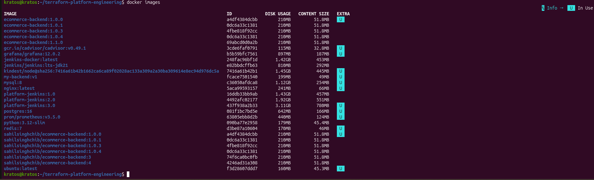

---

### 2. Running Container

Shows the Flask application running inside a Docker container.

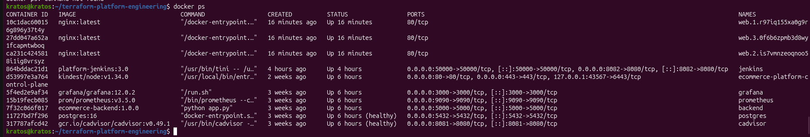

---

### 3. Docker Hub Repository

Shows the application image pushed to Docker Hub for deployment.

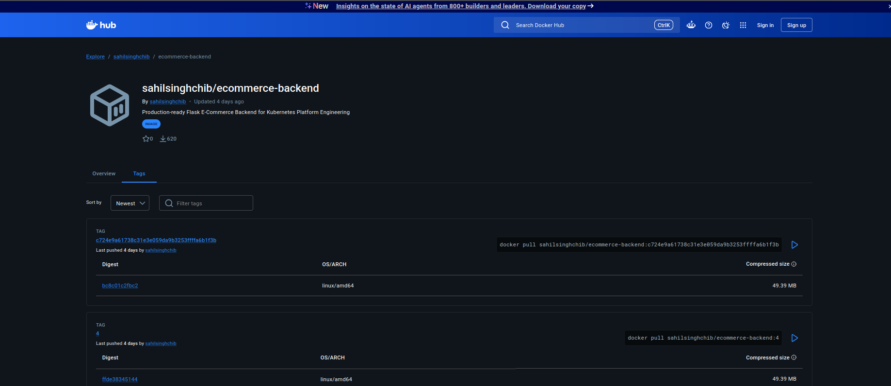
---

## 📄 Project Cheat Sheet

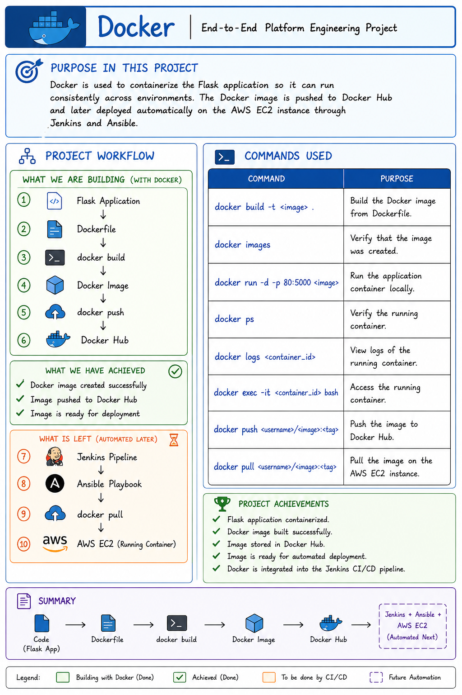

### Project Output

- Flask application containerized successfully
- Docker image built successfully
- Image pushed to Docker Hub
- Image deployed automatically on AWS EC2
---

## ☸️ Kubernetes

### Purpose in this Project

Kubernetes was used to deploy and manage the Dockerized Flask application. It provided self-healing, service discovery and production-style orchestration by replacing Docker Compose with Kubernetes resources.

---

### Files Used

- deployment.yaml
- service.yaml
- ingress.yaml
- statefulset.yaml
- configmap.yaml
- secret.yaml
- pvc.yaml

---

### Commands Used

| Command | Purpose in this Project |
|----------|-------------------------|
| kubectl apply | Deploy Kubernetes resources |
| kubectl get pods | Verify Pods |
| kubectl get svc | Verify Services |
| kubectl get ingress | Verify Ingress |
| kubectl describe pod | Troubleshoot Pods |
| kubectl logs | View application logs |
| kubectl exec | Access running Pod |
| kubectl rollout status | Verify Deployment |
| kubectl rollout undo | Rollback Deployment |

---

### Project Workflow

```text
Docker Image
      │
      ▼
Deployment
      │
      ▼
ReplicaSet
      │
      ▼
Pods
      │
      ▼
Service
      │
      ▼
Ingress
      │
      ▼
Application
```

---

## 📸 Screenshots

### 1. Running Pods

Shows all application pods created successfully.

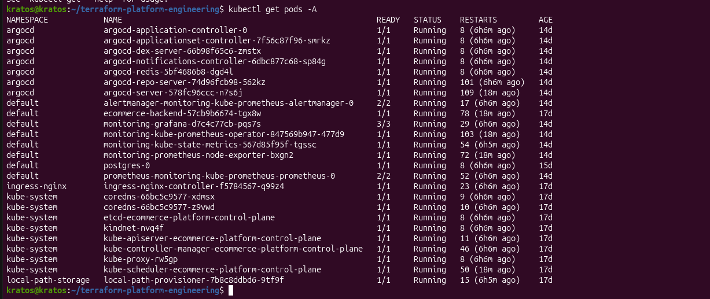

---

### 2. Deployments

Shows the Deployment managing application replicas.

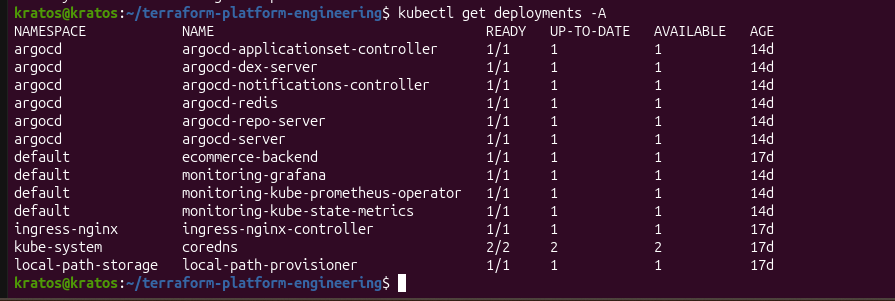

---

### 3. Services

Shows the Kubernetes Service exposing the application.

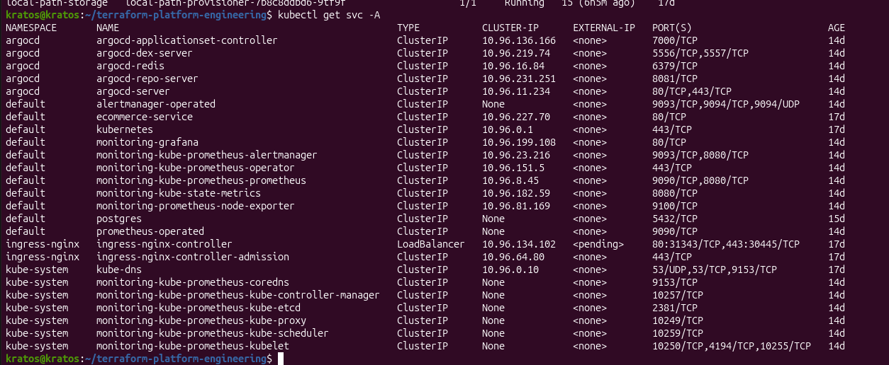

---

### 4. StatefulSet

Shows the PostgreSQL StatefulSet created for persistent storage.

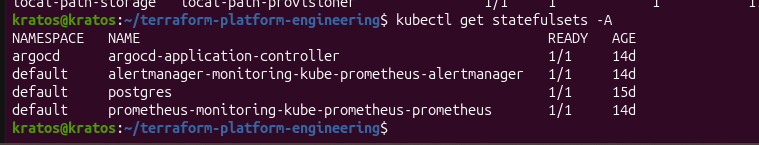

---

### 5. Helm

Shows Helm managing Kubernetes packages.

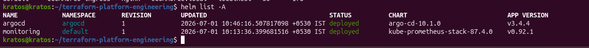

---

## 📄 Project Cheat Sheet

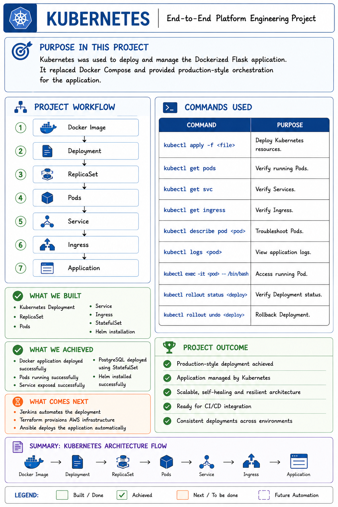

---

### Project Output

- Deployment created successfully.
- Pods running successfully.
- Services exposed successfully.
- Ingress configured successfully


---

## 🔧 Jenkins

### Purpose in this Project

Jenkins was used to automate the complete deployment process. Every code push triggered infrastructure validation, deployment and application rollout without manual intervention.

---

### Files Used

- Jenkinsfile

---

### Commands Used

| Command | Purpose in this Project |
|----------|-------------------------|
| git checkout | Clone repository |
| terraform init | Initialize Terraform |
| terraform validate | Validate configuration |
| terraform plan | Generate execution plan |
| terraform apply | Provision infrastructure |
| ansible-playbook | Deploy application |

---

### Project Workflow

```text
GitHub Push
      │
      ▼
Checkout Source
      │
      ▼
Terraform
      │
      ▼
Ansible
      │
      ▼
Deployment Completed
```

---

## 📸 Screenshots

### 1. Jenkins Pipeline

Shows the successful execution of the complete CI/CD pipeline.

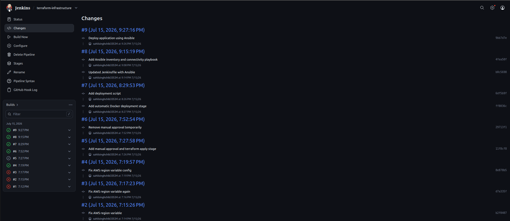

---

## 📄 Project Cheat Sheet

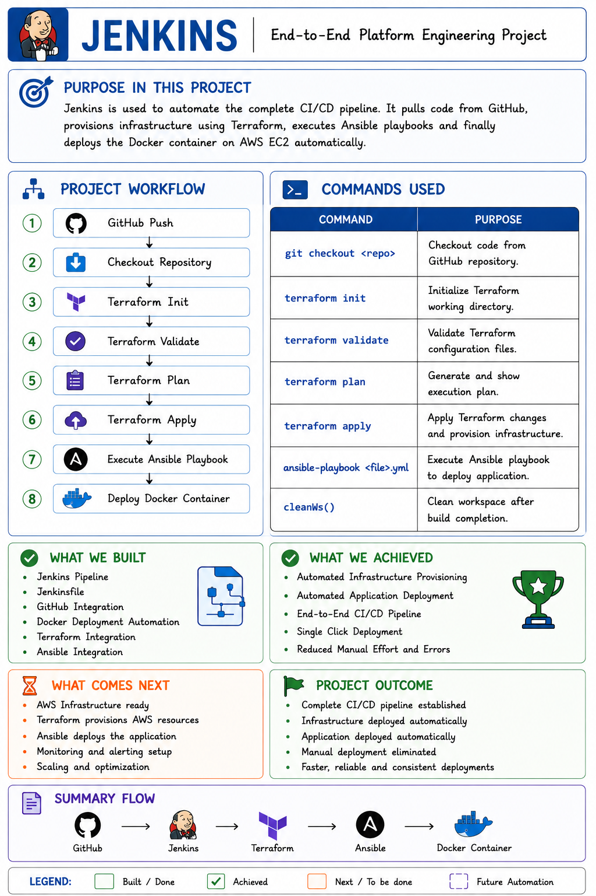

---
### Project Output

- Jenkins pipeline created successfully
- GitHub repository integrated
- Terraform executed automatically
- Ansible playbook executed automatically
- Application deployed successfully
- End-to-End CI/CD pipeline completed

---

---

# ☁️ AWS

### Purpose in this Project

AWS was used to host the complete infrastructure required for the application. Instead of deploying on a local machine, the application was deployed on an EC2 instance inside a custom VPC created using Terraform.

---

### AWS Services Used

- IAM
- VPC
- Subnet
- Internet Gateway
- Route Table
- Security Group
- EC2
- S3 (Terraform Backend)

---

### Resources Created

| Resource | Purpose |
|----------|---------|
| VPC | Private network for the infrastructure |
| Public Subnet | Hosts the EC2 instance |
| Internet Gateway | Provides internet access |
| Route Table | Routes traffic to the Internet Gateway |
| Security Group | Allows SSH and HTTP access |
| EC2 Instance | Hosts the Docker application |
| S3 Bucket | Stores Terraform remote state |

---

### Commands Used

| Command | Purpose in this Project |
|----------|-------------------------|
| aws configure | Configure AWS CLI |
| aws ec2 describe-instances | Verify EC2 instance |
| aws s3 ls | Verify S3 bucket |
| aws ec2 describe-vpcs | Verify VPC |
| aws ec2 describe-security-groups | Verify Security Groups |

---

### Project Workflow

```text
Terraform
      │
      ▼
Create VPC
      │
      ▼
Create Subnet
      │
      ▼
Attach Internet Gateway
      │
      ▼
Configure Route Table
      │
      ▼
Launch EC2 Instance
      │
      ▼
Ready for Deployment
```

---

## 📸 Screenshots

### 1. Custom VPC

Shows the custom VPC created for the project.

**Command Used**

```bash
aws ec2 describe-vpcs
```

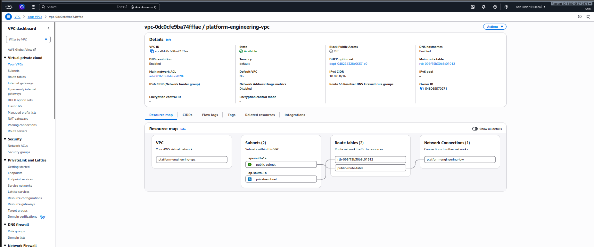

---

### 2. S3 Remote Backend

Shows the S3 bucket used to store the Terraform remote state.

**Command Used**

```bash
aws s3 ls
```

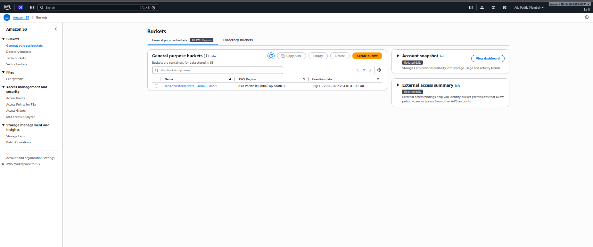

---

### 3. EC2 Instance

Shows the EC2 instance provisioned using Terraform.

**Command Used**

```bash
aws ec2 describe-instances
```

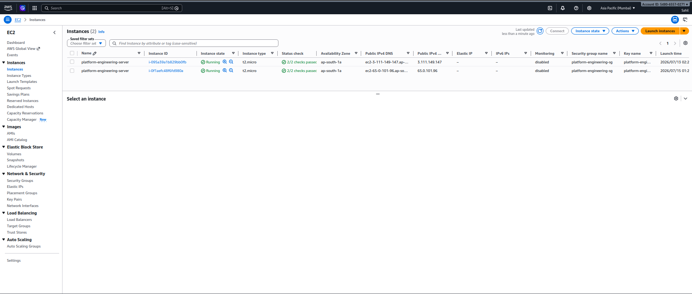

---

### 4. Security Group

Shows the Security Group allowing SSH and HTTP traffic.

**Command Used**

```bash
aws ec2 describe-security-groups
```

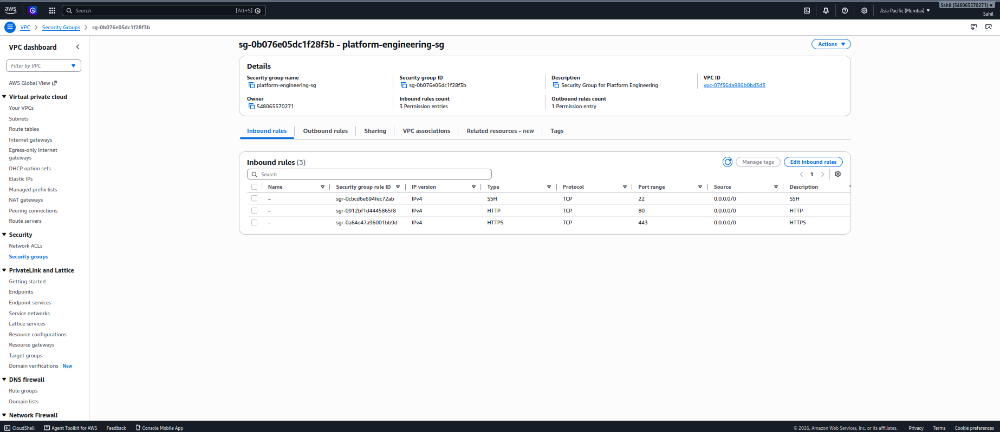

---

### 5. Route Table

Shows the Route Table associated with the public subnet.

**Command Used**

```bash
aws ec2 describe-route-tables
```

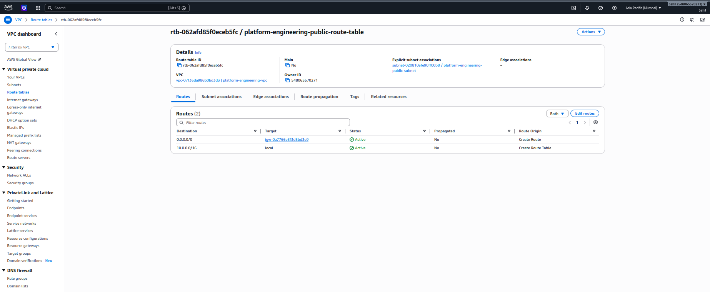

---

### 6. Running EC2 Instance

Shows the EC2 instance running successfully after infrastructure provisioning.

**Command Used**

```bash
aws ec2 describe-instances
```

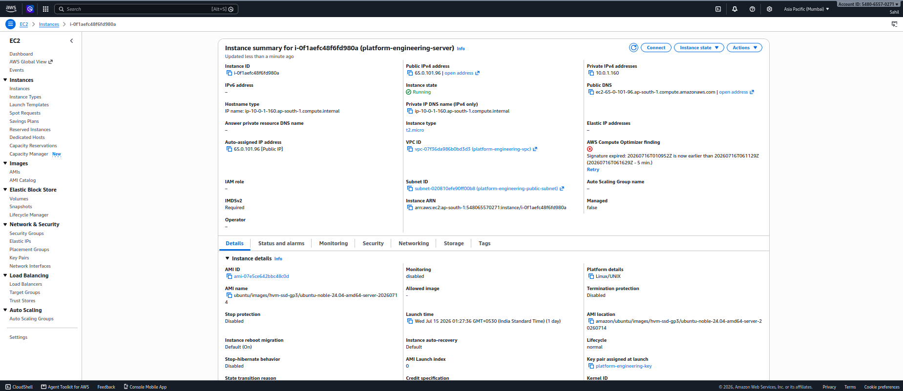

---

## 📄 Project Cheat Sheet

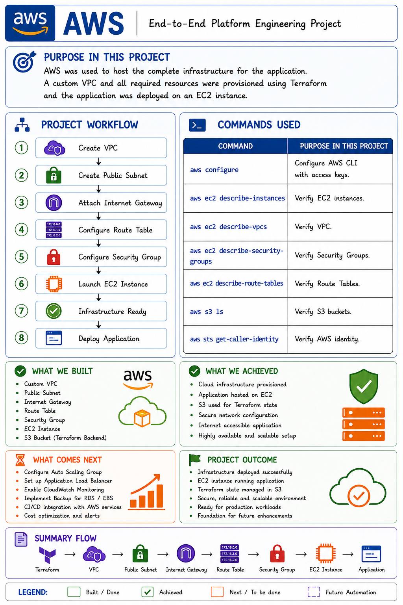

---
---
### Project Output

- Custom VPC created
- Public subnet configured
- Internet Gateway attached
- Route Table associated
- Security Group configured
- EC2 instance launched successfully
- Remote Terraform state stored in S3

---

# 🌍 Terraform

### Purpose in this Project

Terraform was used to provision the complete AWS infrastructure using Infrastructure as Code. Instead of creating resources manually in the AWS Console, every infrastructure component was defined in Terraform configuration files and deployed through the Jenkins pipeline.

---

### Files Used

- provider.tf
- backend.tf
- main.tf
- compute.tf
- variables.tf
- outputs.tf
- terraform.tfvars
- userdata.sh

---

### Commands Used

| Command | Purpose in this Project |
|----------|-------------------------|
| terraform init | Initialize Terraform |
| terraform fmt | Format Terraform files |
| terraform validate | Validate configuration |
| terraform plan | Preview infrastructure changes |
| terraform apply | Create infrastructure |
| terraform output | Display resource outputs |
| terraform state list | Verify managed resources |

---

### Project Workflow

```text
Terraform Files
        │
        ▼
Initialize Backend
        │
        ▼
Validate Configuration
        │
        ▼
Generate Execution Plan
        │
        ▼
Provision AWS Infrastructure
        │
        ▼
Store State in Remote Backend (S3)
```

---

## 📸 Screenshots

### 1. Provider Configuration

Shows the AWS provider configuration used by Terraform.

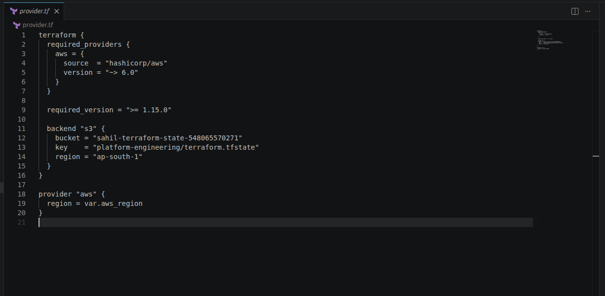

---

### 2. Compute Configuration

Shows the EC2 instance configuration managed by Terraform.

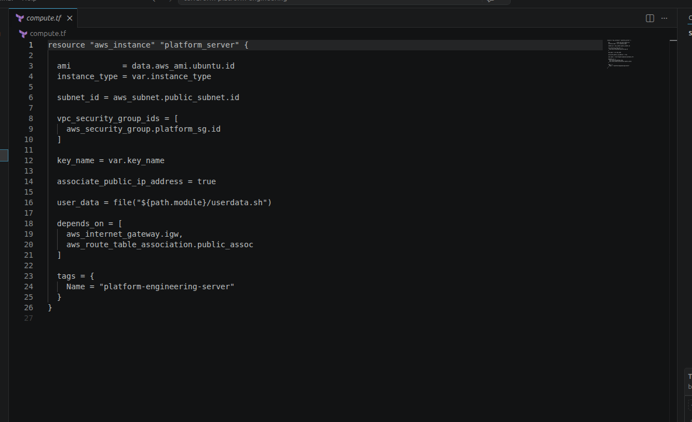

---

### 3. Variables File

Shows the Terraform variables used throughout the project.

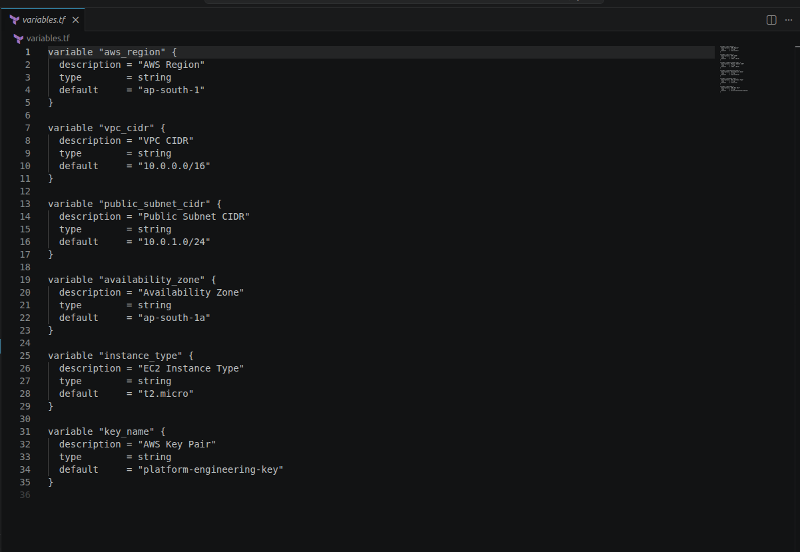

---

### 4. Terraform Plan

Shows Terraform generating the execution plan before infrastructure deployment.

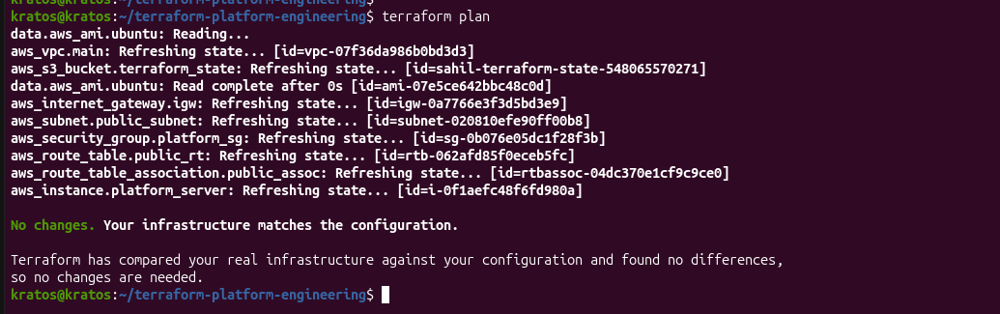

---

### 5. Terraform State List

Shows all AWS resources currently managed by Terraform.

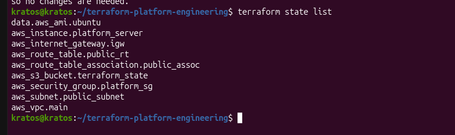

---

### 6. Terraform Output

Shows the infrastructure outputs generated after deployment.

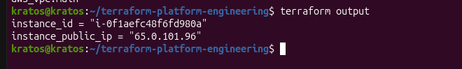

---

## 📄 Project Cheat Sheet

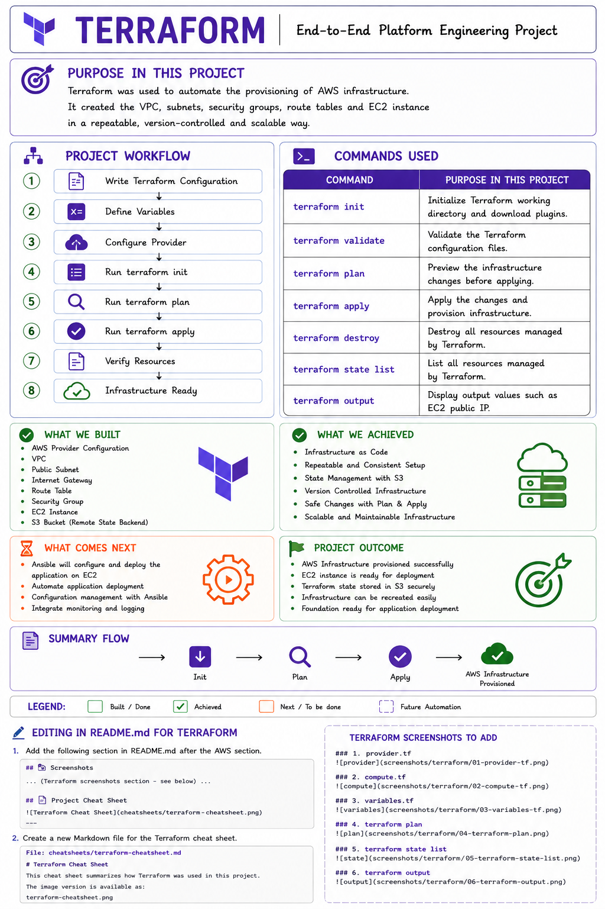

---

### Project Output

- AWS provider configured
- Remote backend configured using S3
- Infrastructure validated successfully
- Execution plan generated
- AWS resources provisioned successfully
- Terraform state managed remotely
- Infrastructure outputs verified

---

# 🤖 Ansible

### Purpose in this Project

Ansible was used to automate the application deployment after the AWS infrastructure was created. Instead of manually connecting to the EC2 instance and running Docker commands, Jenkins executed an Ansible playbook to perform the deployment automatically.

---

### Files Used

- ansible/inventory
- ansible/deploy.yml

---

### Commands Used

| Command | Purpose in this Project |
|----------|-------------------------|
| ansible-playbook | Execute deployment playbook |
| docker pull | Pull latest Docker image |
| docker stop | Stop existing container |
| docker rm | Remove existing container |
| docker run | Start new application container |
| docker ps | Verify deployment |

---

### Project Workflow

```text
Jenkins Pipeline
        │
        ▼
Execute Ansible Playbook
        │
        ▼
Connect to EC2 via SSH
        │
        ▼
Pull Latest Docker Image
        │
        ▼
Stop Existing Container
        │
        ▼
Remove Old Container
        │
        ▼
Start New Container
        │
        ▼
Verify Deployment
```

---

### Project Output

- Connected to EC2 successfully
- Docker image pulled successfully
- Existing container replaced
- New application container deployed
- Deployment verified successfully

---


## 📸 Screenshots

| Screenshot | Description |
|------------|-------------|
| Docker Images | Shows the Docker image created locally |
| Running Container | Verifies the Flask container is running |
| Docker Hub Repository | Confirms the image was pushed successfully |

---

## 📄 Project Cheat Sheet

> *(docker-cheatsheet.png will be added here.)*


